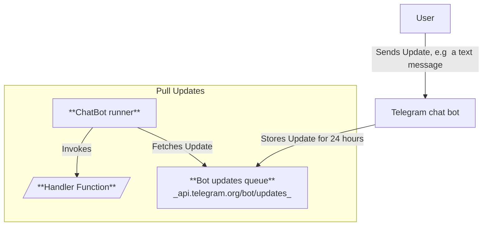

## ChatBot runner

### How this library helps

A chatbot is essentially a **function** that is triggered by every user message, whether it's a text message, a reaction, or a payment update. Lets name this function as **handler function**

This library handles the task of reading these **updates** from the Telegram Bot API's **message queue**. It then invokes the appropriate **handler function** with the received update.

### Playground

Develop/Run chat bots in your browser via **[Chat Bot Playground](https://effect-ak.github.io/telegram-bot-playground/)**

### Local run

You can write the logic for your chatbot and **run it locally** and message to your bot via **Telegram** messenger.

Take a look at examples [here](example)

### Setup Instructions

1. **Create `bot.js` and Implement Your Bot's Logic**

   Create a file (for example `bot.js`) and add your bot's logic as shown below:

   ```typescript
   import { MESSAGE_EFFECTS } from "@effect-ak/tg-bot-client"
   import { runTgChatBot, BotResponse, defineBot } from "@effect-ak/tg-bot-client/bot"

   const BOT = defineBot({
      on_message: (msg) => {

      if (!msg.text) return BotResponse.ignore;

      if (msg?.text === "bye") {
        return BotResponse.make({
          type: "message",
          text: "See you later!",
          message_effect_id: MESSAGE_EFFECTS["❤️"]
        })
      }

      return BotResponse.make({
        type: "message",
        text: "I'm a simple bot"
      })
     }
   })

   runTgChatBot({
     bot_token: "your-token" // PUT YOUR TOKEN HERE
     mode: {
      type: "single",
      ...BOT
     }
   })
   ```

2. **Run the Bot**

   To start your chatbot, execute the following command in your terminal:

   ```bash
   node bot.js
   ```

### How It Works: Pull Model

The Telegram bot supports both **push** and **pull** notification models for messages. This package uses the **pull** model for several reasons:

- **Run chat bots anywhere without exposing public ports or URLs:** The Telegram **push** model requires you as a developer to specify a public URL where updates will be sent.  
  For example, **pull** allows running chat bots in a web browser, which doesn't have a public URL.
- **Leveraging Telegram's infrastructure:** Telegram keeps new updates for 24 hours and gives you plenty of time to process them.

#### Few details and clarifications

Developer is responsible only for **Handler Function**.

**ChatBot runner** reads updates from the queue and shifts **ID** of last proceeded update so that **handler function** won't be triggered multiple times for the same update.

