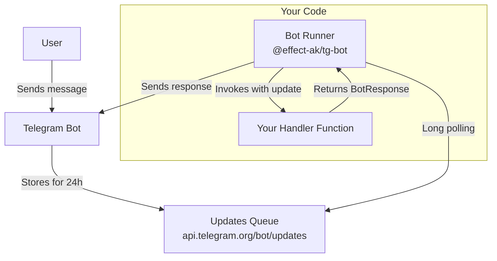

# @effect-ak/tg-bot

[](https://www.npmjs.com/package/@effect-ak/tg-bot)

[](https://opensource.org/licenses/MIT)

Effect-based Telegram bot runner that handles long polling, update processing, and error management automatically.

## Table of Contents

- [Features](#features)
- [Installation](#installation)
- [Quick Start](#quick-start)
- [Core Concepts](#core-concepts)
  - [Single Mode](#single-mode)
  - [Batch Mode](#batch-mode)
  - [Bot Response](#bot-response)
- [Usage Examples](#usage-examples)
  - [Echo Bot](#echo-bot)
  - [Command Handler](#command-handler)
  - [Batch Processing](#batch-processing)
  - [Using Effect](#using-effectjs)
  - [Hot Reload](#hot-reload)
- [Configuration](#configuration)
- [API Reference](#api-reference)
- [How It Works](#how-it-works)
- [Error Handling](#error-handling)
- [Playground](#playground)
- [Related Packages](#related-packages)
- [License](#license)

## Features

- **Effect-based**: Built on top of [Effect](https://effect.website/) for powerful functional programming patterns
- **Two Processing Modes**: Handle updates one-by-one or in batches
- **Automatic Long Polling**: Manages connection to Telegram servers
- **Type-Safe Handlers**: Full TypeScript support for all update types
- **Error Recovery**: Configurable error handling strategies
- **Concurrent Processing**: Process multiple updates in parallel (up to 10 concurrent handlers)
- **Hot Reload**: Reload bot handlers without restarting
- **Built-in Logging**: Configurable logging levels
- **No Public URL Required**: Uses pull model - run bots anywhere, even in a browser

## Installation

```bash
npm install @effect-ak/tg-bot effect
```

```bash
pnpm add @effect-ak/tg-bot effect
```

```bash
yarn add @effect-ak/tg-bot effect
```

**Note:** `effect` is a peer dependency and must be installed separately.

## Quick Start

```typescript
import { runTgChatBot } from "@effect-ak/tg-bot"

runTgChatBot({
  bot_token: "YOUR_BOT_TOKEN",
  mode: "single",
  on_message: [
    {
      match: ({ update }) => !!update.text,
      handle: ({ update, ctx }) => ctx.reply(`You said: ${update.text}`)
    }
  ]
})
```

## Core Concepts

### Single Mode

In single mode, the bot processes each update individually with a dedicated handler for each update type.

**Handler Format (v2 with guards):**

```typescript
on_message: [
  {
    match: ({ update, ctx }) => ctx.command === "/start",  // optional filter
    handle: ({ update, ctx }) => ctx.reply("Welcome!")     // handler
  },
  {
    match: ({ update }) => !!update.text,
    handle: ({ ctx }) => ctx.reply("Got your message!")
  },
  {
    handle: ({ ctx }) => ctx.ignore  // fallback (no match = always runs)
  }
]
```

**Context helpers:**
- `ctx.reply(text, options?)` - Send a message
- `ctx.replyWithDocument(document, options?)` - Send a document
- `ctx.replyWithPhoto(photo, options?)` - Send a photo
- `ctx.command` - Parsed command (e.g., "/start", "/help")
- `ctx.ignore` - Skip response

**Available Handlers:**
- `on_message` - New incoming message
- `on_edited_message` - Message was edited
- `on_channel_post` - New channel post
- `on_edited_channel_post` - Channel post was edited
- `on_inline_query` - Inline query
- `on_chosen_inline_result` - Chosen inline result
- `on_callback_query` - Callback query from inline keyboard
- `on_shipping_query` - Shipping query
- `on_pre_checkout_query` - Pre-checkout query
- `on_poll` - Poll state update
- `on_poll_answer` - User changed their answer in a poll
- `on_my_chat_member` - Bot's chat member status changed
- `on_chat_member` - Chat member status changed
- `on_chat_join_request` - Request to join chat

**Legacy format (v1 - still supported):**

```typescript
on_message: (message) => {
  if (!message.text) return BotResponse.ignore
  return BotResponse.make({ type: "message", text: "Hello!" })
}
```

### Batch Mode

In batch mode, the bot receives all updates as an array and processes them together.

```typescript
runTgChatBot({
  bot_token: "YOUR_BOT_TOKEN",
  mode: "batch",
  on_batch: async (updates) => {
    console.log(`Processing ${updates.length} updates`)
    // Process updates...
    return true // Continue polling
  }
})
```

### Bot Response

Handlers return a `BotResponse` object that describes what to send back to the user.

**Creating Responses:**

```typescript
import { BotResponse } from "@effect-ak/tg-bot"

// Send a message
BotResponse.make({
  type: "message",
  text: "Hello!"
})

// Send a photo
BotResponse.make({
  type: "photo",
  photo: {
    file_content: photoBuffer,
    file_name: "image.jpg"
  },
  caption: "Check this out!"
})

// Ignore update (don't send anything)
BotResponse.ignore
```

**Supported Response Types:**
All Telegram `send_*` methods are supported: `message`, `photo`, `document`, `video`, `audio`, `voice`, `sticker`, `dice`, etc.

## Usage Examples

### Echo Bot

```typescript
import { runTgChatBot, defineBot } from "@effect-ak/tg-bot"

const ECHO_BOT = defineBot({
  on_message: [
    {
      match: ({ update }) => !!update.text,
      handle: ({ update, ctx }) => ctx.reply(update.text!)
    }
  ]
})

runTgChatBot({
  bot_token: "YOUR_BOT_TOKEN",
  mode: "single",
  ...ECHO_BOT
})
```

### Command Handler

```typescript
import { runTgChatBot } from "@effect-ak/tg-bot"
import { MESSAGE_EFFECTS } from "@effect-ak/tg-bot-client"

runTgChatBot({
  bot_token: "YOUR_BOT_TOKEN",
  mode: "single",
  on_message: [
    {
      match: ({ ctx }) => ctx.command === "/start",
      handle: ({ ctx }) => ctx.reply("Welcome! Send me any message.", {
        message_effect_id: MESSAGE_EFFECTS["🎉"]
      })
    },
    {
      match: ({ ctx }) => ctx.command === "/help",
      handle: ({ ctx }) => ctx.reply("Available commands:\n/start - Start bot\n/help - Show help")
    }
  ]
})
```

### Batch Processing

```typescript
import { runTgChatBot } from "@effect-ak/tg-bot"
import { makeTgBotClient } from "@effect-ak/tg-bot-client"

const client = makeTgBotClient({ bot_token: "YOUR_BOT_TOKEN" })

runTgChatBot({
  bot_token: "YOUR_BOT_TOKEN",
  mode: "batch",
  poll: {
    batch_size: 100,
    poll_timeout: 60
  },
  on_batch: async (updates) => {
    const messages = updates
      .map(u => u.message)
      .filter(m => m != null)

    await client.execute("send_message", {
      chat_id: "ADMIN_CHAT_ID",
      text: `Processed ${messages.length} messages`
    })

    return true // Continue polling
  }
})
```

### Using Effect

Advanced usage with Effect for composable async operations:

```typescript
import { Effect, Micro, pipe } from "effect"
import { launchBot } from "@effect-ak/tg-bot"

Effect.gen(function* () {
  const bot = yield* launchBot({
    bot_token: "YOUR_BOT_TOKEN",
    mode: "single",
    poll: {
      log_level: "debug"
    },
    on_message: [
      {
        match: ({ update }) => !!update.text,
        handle: async ({ ctx }) => {
          await Effect.sleep("2 seconds").pipe(Effect.runPromise)
          return ctx.reply("Delayed response!")
        }
      }
    ]
  })

  // Access bot fiber for control
  yield* pipe(
    Micro.fiberAwait(bot.fiber()!),
    Effect.andThen(Effect.logInfo("Bot stopped")),
    Effect.forkDaemon
  )
}).pipe(Effect.runPromise)
```

### Hot Reload

```typescript
import { runTgChatBot } from "@effect-ak/tg-bot"

const bot = await runTgChatBot({
  bot_token: "YOUR_BOT_TOKEN",
  mode: "single",
  on_message: [
    {
      match: ({ update }) => !!update.text,
      handle: ({ ctx }) => ctx.reply("Version 1")
    }
  ]
})

// Later, reload with new handlers
setTimeout(() => {
  bot.reload({
    type: "single",
    on_message: [
      {
        match: ({ update }) => !!update.text,
        handle: ({ ctx }) => ctx.reply("Version 2 - Hot reloaded!")
      }
    ]
  })
}, 5000)
```

## Configuration

### Poll Settings

Configure how the bot polls for updates:

```typescript
runTgChatBot({
  bot_token: "YOUR_BOT_TOKEN",
  mode: "single",  // or "batch"
  poll: {
    log_level: "debug",        // "info" | "debug"
    on_error: "continue",      // "stop" | "continue"
    batch_size: 50,            // 10-100
    poll_timeout: 30,          // 2-120 seconds
    max_empty_responses: 5     // Stop after N empty responses
  },
  on_message: [/* ... */]  // handlers at top level
})
```

**Options:**

- `log_level` (default: `"info"`): Logging verbosity
  - `"info"` - Basic logging (new messages, errors)
  - `"debug"` - Detailed logging (all updates, responses)

- `on_error` (default: `"stop"`): Error handling strategy
  - `"stop"` - Stop bot on error
  - `"continue"` - Continue polling after errors

- `batch_size` (default: `10`): Number of updates to fetch per poll (10-100)

- `poll_timeout` (default: `10`): Long polling timeout in seconds (2-120)

- `max_empty_responses` (default: `undefined`): Stop after N consecutive empty responses (useful for testing)

## API Reference

### `runTgChatBot(input)`

Starts the bot with long polling.

**Parameters:**
- `bot_token` (string, required): Bot token from @BotFather
- `mode` (`"single"` | `"batch"`, required): Processing mode
- `poll` (object, optional): Polling configuration
- `on_message`, `on_callback_query`, etc. (optional): Update handlers (for single mode)
- `on_batch` (required for batch mode): Batch handler function

**Returns:** `Promise<BotInstance>`

### `launchBot(input)`

Launches bot and returns a bot instance for advanced control.

**Returns:** `Micro<BotInstance>`
- `BotInstance.reload(mode)` - Hot reload handlers
- `BotInstance.fiber()` - Access underlying Effect fiber

### `defineBot(handlers)`

Helper to define bot handlers with type checking and validation.

**Parameters:**
- `handlers` (object): Handler functions for different update types

**Returns:** `BotUpdatesHandlers`

### `BotResponse.make(response)`

Creates a bot response.

**Parameters:**
- `response` (object): Response configuration with `type` and parameters

**Returns:** `BotResponse`

### `BotResponse.ignore`

Singleton instance for ignoring updates (no response).

## How It Works

### Pull Model Architecture

The Telegram bot API supports both **push** and **pull** notification models. This package uses the **pull** model for several key advantages:

- **Run bots anywhere without public URLs:** No need to expose public ports or configure webhooks. You can run bots locally, in a browser, or behind firewalls.
- **Leverage Telegram's infrastructure:** Telegram stores updates for 24 hours, giving you plenty of time to process them.
- **Simpler deployment:** No SSL certificates, no webhook configuration, no reverse proxies required.

### Architecture Diagram



**How it works:**
1. User sends a message to your bot
2. Telegram stores the update in a queue for 24 hours
3. Bot runner polls the queue using long polling
4. Runner invokes your handler function with the update
5. Handler returns a `BotResponse`
6. Runner sends the response back to Telegram
7. Runner tracks the last processed update ID to avoid duplicates

## Error Handling

The bot automatically handles errors at different levels:

### Update Handler Errors

If a handler throws an error, the bot:
1. Logs the error with update details
2. Sends an error message to the user (in single mode)
3. Continues processing other updates (if `on_error: "continue"`)

```typescript
on_message: [
  {
    match: ({ ctx }) => ctx.command === "/error",
    handle: () => {
      throw new Error("Something went wrong!")
      // Bot will catch this and send error message to user
    }
  },
  {
    match: ({ update }) => !!update.text,
    handle: ({ ctx }) => ctx.reply("OK")
  }
]
```

### Batch Handler Errors

In batch mode, returning `false` stops the bot:

```typescript
on_batch: async (updates) => {
  try {
    // Process updates
    return true // Continue
  } catch (error) {
    console.error(error)
    return false // Stop bot
  }
}
```

### Concurrent Processing

In single mode, up to 10 updates are processed concurrently. If some handlers fail, others continue processing.

## Playground

Develop and test your bot directly in the browser:

**[Chat Bot Playground](https://effect-ak.github.io/telegram-bot-playground/)**

No installation required - perfect for quick prototyping and learning!

## Related Packages

This package is part of the `tg-bot-client` monorepo:

- **[@effect-ak/tg-bot-client](../client)** - Type-safe HTTP client for Telegram Bot API
- **[@effect-ak/tg-bot-api](../api)** - TypeScript types for Telegram Bot API and Mini Apps
- **[@effect-ak/tg-bot-codegen](../codegen)** - Code generator that parses official documentation

## License

MIT © [Aleksandr Kondaurov](https://github.com/effect-ak)
