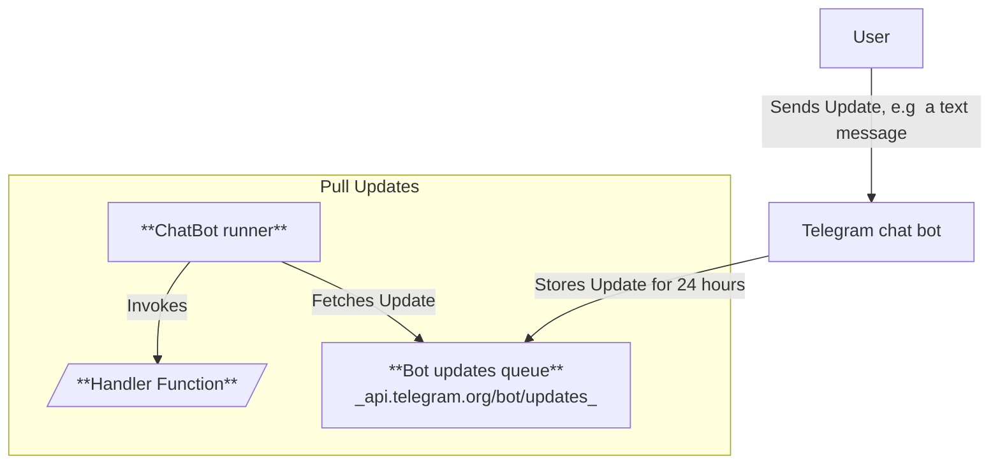

[](https://www.npmjs.com/package/@effect-ak/tg-bot-client)


[](https://effect-ak.github.io/telegram-bot-api/)


## Motivation
**Telegram** does not offer an official TypeScript **SDK** for their **API** but they provide documentation in HTML format.

This package aims to parse official documentation of [Bot Api](https://core.telegram.org/bots/api) and [Telegram.Webapp](https://core.telegram.org/bots/api)  and generate **TypeScript types**!

## Highlights:
- **[Client](#client)**: Light TypeScript client
- **Complete and Up-to-Date Telegram Bot API**: The entire API is generated from [the official documentation](https://core.telegram.org/bots/api) using a [code generator](./codegen/main.ts), ensuring this client remains in sync and supports every method and type provided by the **Telegram Bot API**.
- **[Types for Webapps](#webapps-typings)** Types that describe `Telegram.WebApp`. Created by [code generator](./codegen/main.ts) as well.
- **[ChatBot runner](#chatbot-runner)**: Focus on the logic of your chat bot
- **Type Mapping**: Types from the documentation are converted to TypeScript types:
  - `Integer` → `number`
  - `True` → `boolean`
  - `String or Number` → `string | number`
  - Enumerated types, such as `"Type of the chat can be either “private”, “group”, “supergroup” or “channel”"`, are converted to a standard union of literal types `"private" | "group" | "supergroup" | "channel"`
  - And more...

## Client

```typescript
import { makeTgBotClient } from "@effect-ak/tg-bot-client"

const client = makeTgBotClient({
  bot_token: "" //your token taken from bot father
});
```

### Executing api methods (Promise based)

`client` has an `execute` method which requires two arguments

- the first is the API method, e.g. `send_message`
- the second is an object containing the arguments for that method, e.g. `text`

> Method names, such as `setChatAdministratorCustomTitle`, are converted to snake_case for easier code readability, e.g., `set_chat_administrator_custom_title`.

#### 1. Sending a Message with an Effect

```typescript
import { MESSAGE_EFFECTS } from "@effect-ak/tg-bot-client"

await client.execute("send_message", {
  chat_id: "???", // replace ??? with the chat number
  text: "hey again",
  message_effect_id: MESSAGE_EFFECTS["🔥"]
});
```

#### 2. Sending a Dice

```typescript
import { MESSAGE_EFFECTS } from "@effect-ak/tg-bot-client"

await client.execute("send_dice", {
  chat_id: "???", // replace ??? with the chat number
  emoji: "🎲"
});
```

#### 3. Sending a Document

```typescript
import { MESSAGE_EFFECTS } from "@effect-ak/tg-bot-client"

await client.execute("send_document", {
  chat_id: "???", // replace ??? with the chat number
  message_effect_id: MESSAGE_EFFECTS["🎉"],
  document: {
    file_content: new TextEncoder().encode("Hello!"),
    file_name: "hello.txt"
  },
  caption: "simple text file"
})
```


#### 4. Getting a file

In order to download file from Telegram server we need to send two http requests:
1. execute `get_file` and get `remote_path`
2. get file content via GET request with different url

`client.getFile` does exactly that. It returns [`File`](https://developer.mozilla.org/en-US/docs/Web/API/File)

```typescript
const file = 
  await client.getFile({ 
    file_id: fileId
  });
```

### Executing api methods (Effect based)

If you want to use [Effect](https://effect.website/) instead of `Promise`:
```typescript
import { executeTgBotMethod, TgBotApiToken } from "@effect-ak/tg-bot-client";
import { Effect } from "effect";

executeTgBotMethod("send_message", {
  text: "hello",
  chat_id: config.chat_id
}).pipe(
  Effect.provideService(TgBotApiToken, 'your-token-from-bot-father'),
  Effect.runPromiseExit
)
```

## ChatBot runner

### How this library helps

A chatbot is essentially a **function** that is triggered by every user message, whether it's a text message, a reaction, or a payment update. Lets name this function as **handler function**

This library handles the task of reading these **updates** from the Telegram Bot API's **message queue**. It then invokes the appropriate **handler function** with the received update.

### Playground

Develop/Run chat bots in your browser via **[Chat Bot Playground](https://effect-ak.github.io/telegram-bot-playground/)**

### Local run

You can write the logic for your chatbot and **run it locally** and message to your bot via **Telegram** messenger.

Take a look at examples [here](example)

### Setup Instructions

1. **Create `bot.js` and Implement Your Bot's Logic**

   Create a file (for example `bot.js`) and add your bot's logic as shown below:

   ```typescript
   import { MESSAGE_EFFECTS } from "@effect-ak/tg-bot-client"
   import { runTgChatBot, BotResponse, defineBot } from "@effect-ak/tg-bot-client/bot"

   const BOT = defineBot({
      on_message: (msg) => {

      if (!msg.text) return BotResponse.ignore;

      if (msg?.text === "bye") {
        return BotResponse.make({
          type: "message",
          text: "See you later!",
          message_effect_id: MESSAGE_EFFECTS["❤️"]
        })
      }

      return BotResponse.make({
        type: "message",
        text: "I'm a simple bot"
      })
     }
   })

   runTgChatBot({
     bot_token: "your-token" // PUT YOUR TOKEN HERE
     mode: {
      type: "single",
      ...BOT
     }
   })
   ```

2. **Run the Bot**

   To start your chatbot, execute the following command in your terminal:

   ```bash
   node bot.js
   ```

### How It Works: Pull Model

The Telegram bot supports both **push** and **pull** notification models for messages. This package uses the **pull** model for several reasons:

- **Run chat bots anywhere without exposing public ports or URLs:** The Telegram **push** model requires you as a developer to specify a public URL where updates will be sent.  
  For example, **pull** allows running chat bots in a web browser, which doesn't have a public URL.
  
- **Leveraging Telegram's infrastructure:** Telegram keeps new updates for 24 hours and gives you plenty of time to process them.

#### Few details and clarifications

Developer is responsible only for **Handler Function**.

**ChatBot runner** reads updates from the  queue and shifts **ID** of last proceeded update so that **handler function** won't be triggered multiple times for the same update.



## Webapps typings

Telegram provides a big [html](https://core.telegram.org/bots/webapps) page that describes `Telegram.WebApp`

`@effect-ak/tg-bot-client` leverages scrapper's functionality to generate TypeScript types.

```typescript
import type { WebApp } from "@effect-ak/tg-bot-client/webapp";

interface Telegram {
  WebApp: TgWebApp
}

declare const Telegram: Telegram;

const saveData = () => {

  Telegram.WebApp.CloudStorage.setItem("key1", "some data", (error) => {
    if (error == null) {
      console.log("Saved!")
    }
  })

}
```
